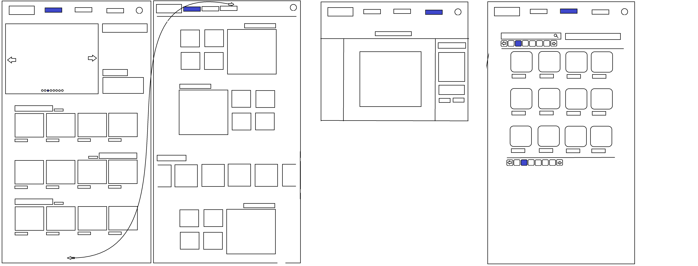

# Frontend server

## How to run frontend in development?

```
npm i
npm run dev
```

## How does it work?

Using Canvas2D API we are able to write pixels to a canvas, turn those into a DataURL, and return that to our backend for storage to a database along with user information.

Uses a proxy from [vite.config.js](./vite.config.js) file to connect directly to the backend API on port: 8080

## Technologies used:

### Production

-   React
-   Redux

### Development

-   esLint
-   Vite
-   Tailwind

<details>

<summary>Initial Wireframe</summary>



</details>
